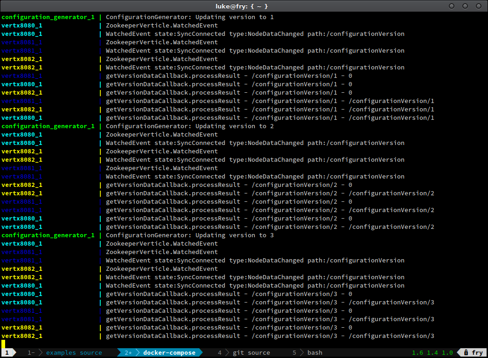
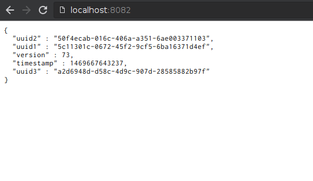

# Vertx Configuration via Zookeeper

_This example uses docker-compose to setup a 5 server
[Zookeeper](https://zookeeper.apache.org/) service, 3 [vert.x](http://vertx.io/)
web servers, and one service that periodically sends updates to a Zookeeper path
for the vert.x web servers._

_You might find the docker-compose.yml, Dockerfile.zookeeper, zoo.cfg, and
zookeeper-entrypoint.sh files to be useful in other projects where you want to
quickly setup a Zookeeper service as the instructions for many of the docker
images for Zookeeper are not very robust._

## Table of contents

  * [Building](#building)
  * [Running and Screenshots](#running-and-screenshots)

## Files

__src/com/lukeolbrish/example:__
* __ConfigurationGenerator.java__ - Generates "configrations" and loads them into Zookeeper periodically
* __Constants.java__ - constants for the connection string and path in Zookeeper
* __SimpleWebsiteMain.java__ - An example of the vert.x website that does not watch for updated "configs" in Zookeeper
* __WebsiteMain.java__ - The vert.x website that does get updated "configs"
* __ZookeeperVerticle.java__ - The vert.x Verticle(Service) that watches Zookeeper for configuration updates.

## Requirements

This example requires [docker version 1.11+](https://www.docker.com/) and
[docker-compose version 1.6+](https://docs.docker.com/compose/).

The directory is already set up for eclipse neon if you "Open Projects From
Filesystem..."

## Building

```shell
mvn package
```

_If you do not have maven installed, you can build using docker:_

```shell
mkdir .m2
docker run -it \
           --rm \
           --name maven-build \
           -v "$PWD":/usr/src/myproject \
           -v "$PWD"/.m2:/root/.m2 \
           -w /usr/src/myproject \
       maven:3-jdk-8 mvn package
```

1. run in a docker image using an interactive pseudo-tty
2. removing the container on exit
3. name the container "maven-build"
4. bind the current directory to a location inside the container so the build result can be saved outside the container
5. bind the .m2 directory to the container's maven repository location so we only download the jars needed once to not waste network resources
6. set the working directory in the container to the current directory outside the container
7. Use a maven jdk-8 image and run maven to package a jar.

## Running and Screenshots

```shell
docker-compose up
```

__Linux__

_You can now monitor the app in your terminal and use 127.0.0.1:8080,
127.0.0.1:8081, and 127.0.0.1:8082 to see the three webservers serve the latest
configuration._

__Other Operating Systems__

```shell
docker-machine ip
```

_You can now monitor the app in your terminal and use docker-machine-ip:8080,
docker-machine-ip:8081, and docker-machine-ip:8082 to see the three webservers
serve the latest configuration._

__running zkcli__

```shell
docker-compose run --rm zkcli -server zookeeper3
```

__The Terminal:__



__The Browser Result:__



_Pressing ctrl-c will should stop docker-compose but I would also recommend
using docker-compose down before calling docker-compose a second time._

_You can also test Zookeeper a bit by killing some of the zookeeper containers
and seeing how the app responds._
